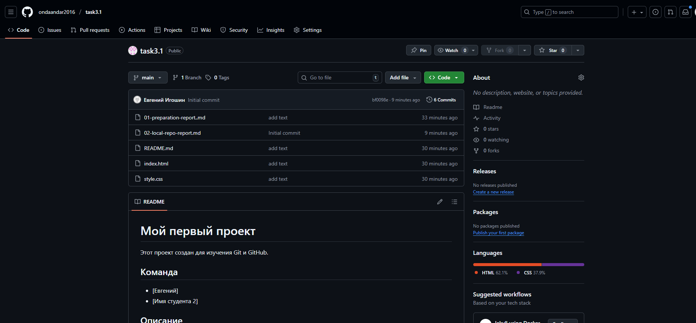

# Отчет по настройке GitHub

**Дата:** [08.10.2025]  
**Команда:** [Евгений] и [Имя студента 2]

## Выполненные действия:

### Шаг 2.1: Создание репозитория на GitHub
- URL репозитория: [https://github.com/ondaandar2016/task3.1.git]
- Видимость: Public
- [ +] Репозиторий создан без README

### Шаг 2.2: Связывание репозиториев
- [ +] Команда git remote add выполнена
- [ +] Ветка переименована в main
- [ +] Push выполнен успешно

## Проверка:
1. Откройте репозиторий на GitHub
2. [+ ] Файлы index.html, style.css, README.md отображаются
3. [+ ] История коммитов показывает "Initial commit"

## Скриншоты:
[]

## Проблемы и решения:
[Опишите проблемы при связывании репозиториев]

## Вывод:
[Что узнали о работе с удаленными репозиториями]