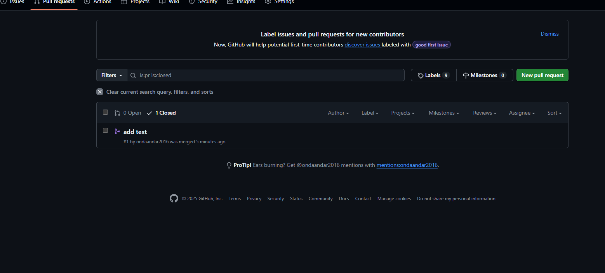

# Отчет по слиянию изменений

**Дата:** [08.10.2025]  
**Команда:** [Евгений] и [Артем]

## Выполненные действия:

### Pull Requests:
- PR студента 1: [https://github.com/ondaandar2016/task3.1/pulls] ✅
- PR студента 2: [https://github.com/cor4mennj-a11y/3.1/pulls] ✅

### Code Review:
- [+ ] Оба PR проверены
- [+ ] Оба PR approved

### Слияние:
- [ +] Оба PR успешно слиты в main
- [ +] Ветки удалены на GitHub (опционально)

### Обновление локальной копии:
- [ +] Локальная ветка main обновлена
- [ +] Все изменения присутствуют

## Проверка финального результата:
1. Откройте index.html в браузере
2. [ +] Раздел "Навыки" отображается
3. [ +] Форма "Контакты" отображается
4. [ +] Все стили работают корректно

## Скриншоты:
[]

## Проблемы и решения:
[Опишите проблемы при слиянии и как их решили]

## Вывод:
[Что узнали о процессе Code Review и слиянии изменений]